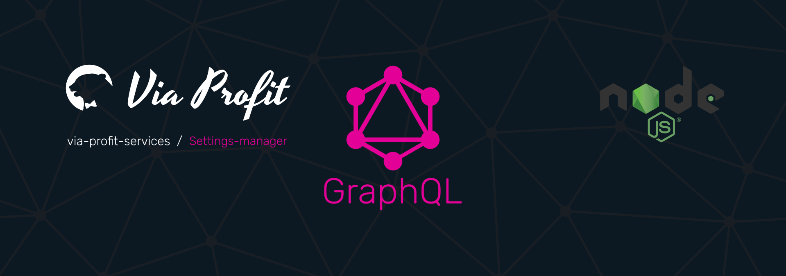

# Via Profit services / Settings-Manager



> Via Profit services / **Settings-Manager** - это пакет, который является частью сервиса, базирующегося на `via-profit-services` и представляет собой реализацию схемы для хранения каких-либо настроек, например, настроек ползователей.

## Содержание

- [Установка и настройка](#setup)
- [Как использовать](#how-to-use)

## <a name="setup"></a> Установка и настройка

### Установка

```bash
yarn add ssh://git@gitlab.com:via-profit-services/settings-manager.git#semver:^0.1.3
```


Список версий [см. здесь](https://gitlab.com/via-profit-services/settings-manager/-/tags)


### Миграции

После первой установки примените все необходимые миграции:

```bash
yarn knex:migrate:latest
```

После применения миграций будут созданы все необходимые таблицы в вашей базе данных


## <a name="how-to-use"></a> Как использовать

Модуль экспортирует наружу:
 - typeDefs - Типы
 - resolvers - Резолверы
 - service - Класс, реализующий модель данного модуля
 - permissions - Разрешения для [GraphQL-chield](https://github.com/maticzav/graphql-shield)

Для интеграции модуля, просто, задействуйте в своем приложении экспортируемые типы и резолверы

Пример использования:

```ts
import { App } from '@via-profit-services/core';
import { typeDefs, resolvers } from '@via-profit-services/settings-manager';

const app = new App({
  ...
  typeDefs,
  resolvers,
  ...
});
app.bootstrap();

```


## TODO

- [ ] Write the CONTRIBUTING docs
- [ ] Write the tests
- [ ] Create Subscriptions
